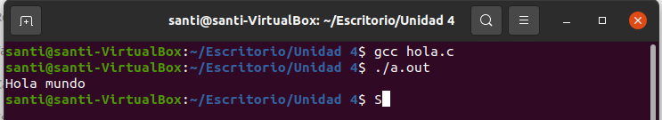
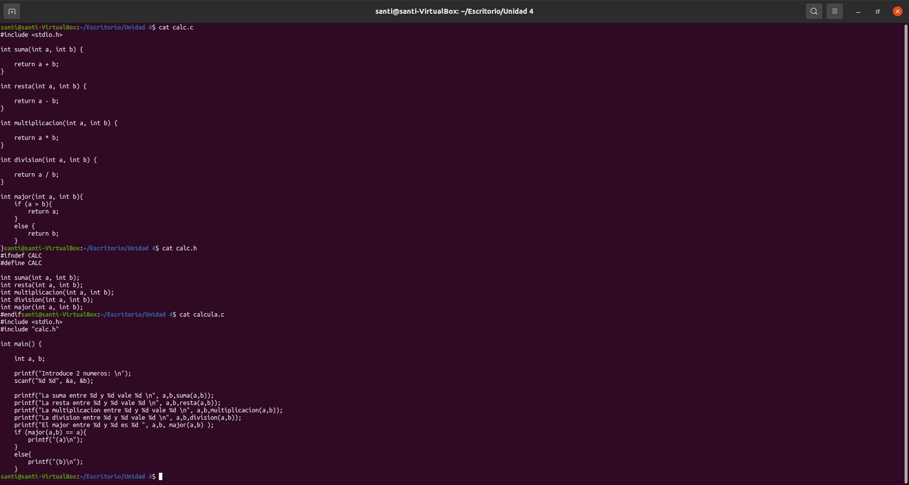
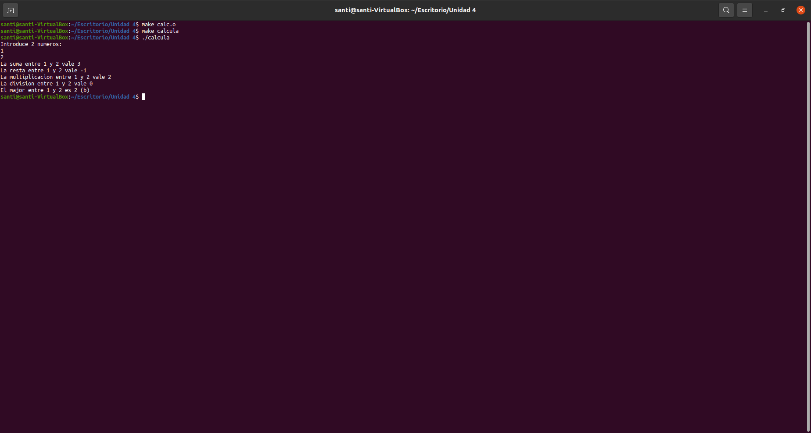
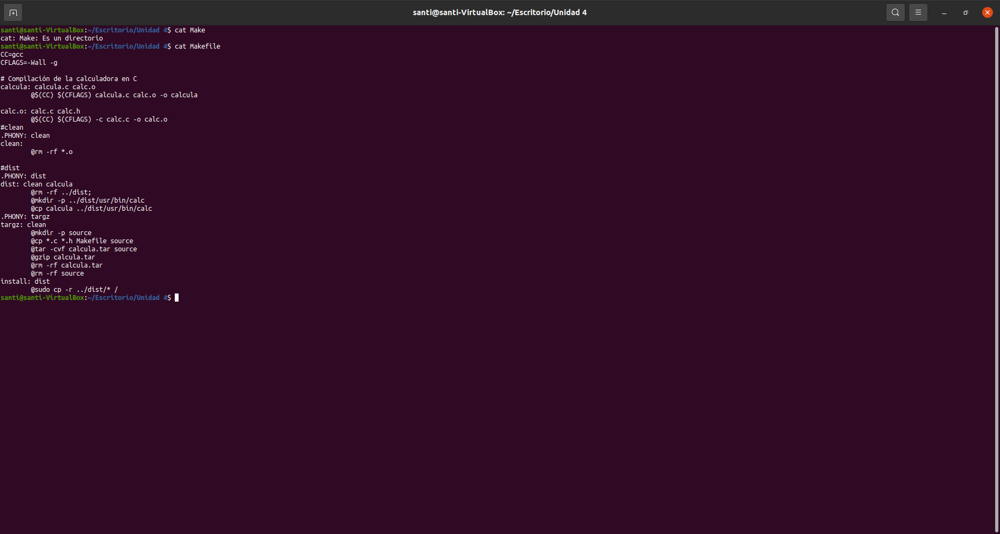

# Documentacio del projecte sobre Make

1. Exemple de compilació del fitxer hola.c, caldrà que estiga aquest fitxer al repositori i que mostreu i expliqueu la seua compilació i funcionament al fitxer README.md.

2. Exemple de la calculadora (fitxers calc.c, calcula.c i calc.h), amb la funcionalitat dels exemples més la funció major(), que haureu d'implementar, i que mostrava quin dels dos números proporcionats com a arguments era major.

3. Fitxer Makefile amb els targets: calcula, calc.o, clean, dist, targz i install

4. Comproveu, i mostreu a la memòria el funcionament de tots els targets.

## 1. Exemple de compilació del fitxer hola.c, caldrà que estiga aquest fitxer al repositori i que mostreu i expliqueu la seua compilació i funcionament al fitxer README.md.

Lo que hacemos es usar el comando gcc (GNU Compiler Collection):
~~~
gcc nombredelarchivo
~~~
Este es el compilador que traen muchos sistemas linux por defecto asi que lo ejecutamos y le damos el nombre del fichero a compilar, en este caso no le digo que le ponga un nombre en especifico pero de quererlo seria asi:
~~~
gcc nombredelarchivo -o nombredelout
~~~

Lo siguiente que he hecho ha sido ejecutar el codigo, esto es tan simple como usar
~~~
./nombredelarchivo
~~~

## 2. Exemple de la calculadora (fitxers calc.c, calcula.c i calc.h), amb la funcionalitat dels exemples més la funció major(), que haureu d'implementar, i que mostrava quin dels dos números proporcionats com a arguments era major.

Este es el contenido de los 3 archivos, ahora usare el contenido del makefile para ejecutar el calc

## 3. Fitxer Makefile amb els targets: calcula, calc.o, clean, dist, targz i install

He puesto @ delante de cada comando para evitar que cada vez que se ejecute nos imprima cada comando

## 4. Comproveu, i mostreu a la memòria el funcionament de tots els targets.

Para hacer estas pruebas he quitado los "@"

